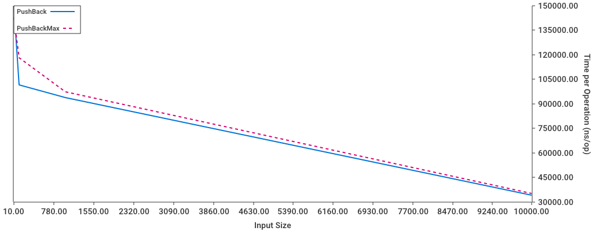

# Messing around with heaps in Go

<center>

</center>

Some basic operations in heap structure viewed in a interactive manner, and also his performance. The `pkg` includes methods to `PushBack`, `PushFront`, `GoUp` and `GoDown` in a slice with a heap property. Also you can visualize it in a pretty manner with `prettyprint`, also inside `pkg`.

### PrettyPrint

The heap will be exhibited like this:

```
               50
               / \
       48               45
       / \               / \
   29       15       35       40
   / \       / \       / \       / \
 27   26   4   12   33   30   37   20
 / \   /
21 19 25
```

## Usage

- **Compiling and Running**:

  For building the interactive version.

  ```terminal
  make i
  ```

  > It will generate the executable `interactive-heap`

  Or you can run, directly with:

  ```terminal
  make run-i
  ```

- **Benching**:

  You can run:

  ```terminal
  make bench
  ```

  And then:

  ```
  make graphs
  ```

  To build a graph like this

  

  > [!NOTE]
  > For showing hidden tests, like the `PushFront`, go in `cmd/benchmark/main.go` and change this line

  ```go
  "PushFront": {
  StrokeColor: chart.ColorYellow,
  StrokeWidth: 2,
  Hidden:      true,
  },            ☝️
  ```

## Contributing

- Implement a `PopFront` and `PopBack` for the heap.
- Implement the `HeapSort`.

---

&copy; Lima
